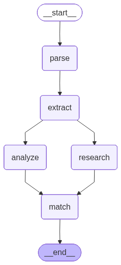

# Career Path Advisor

AI-powered career development platform that analyzes CVs and provides personalized career recommendations using a multi-agent LangGraph pipeline.



## Overview

Career Path Advisor takes a user's CV as input and runs it through a 5-node AI pipeline to extract skills, identify gaps, find matching opportunities from a database, and deliver actionable career recommendations — all within seconds.

### Pipeline Architecture

The system uses a **fan-out / fan-in** parallel execution pattern:

```
parse → extract → ┬─ analyze (LLM)  ─┬→ match → END
                   └─ research (DB)  ─┘
```

| Node | Type | Description |
|------|------|-------------|
| **parse** | 🤖 LLM | Extracts structured data (name, education, experience) from raw CV text |
| **extract** | 🤖 LLM | Identifies technical and soft skills with proficiency levels |
| **analyze** | 🤖 LLM | Performs gap analysis between current skills and target role requirements |
| **research** | 🗄️ Database | Queries PostgreSQL (pgvector) for matching internships, courses, and certifications via semantic vector search |
| **match** | ⚡ Algorithm | Ranks opportunities using a hybrid scoring algorithm (cosine similarity + exact match) |

> `analyze` and `research` run **in parallel** after `extract`. The `match` node waits for both to complete before executing.

## Tech Stack

### Backend
- **Orchestration:** LangGraph, LangChain
- **LLM:** GPT-4o-mini (OpenAI) — configurable
- **API:** FastAPI + Uvicorn
- **Database:** PostgreSQL with pgvector (hosted on Supabase)
- **Caching:** Custom fuzzy cache with RapidFuzz (99% similarity threshold)

### Frontend
- **Framework:** Next.js 15 (React 19)
- **Styling:** Tailwind CSS
- **Language:** TypeScript

## Key Technical Decisions

- **LLM-free matching:** Skill matching uses a deterministic hybrid algorithm instead of LLM calls, reducing latency from ~2s to <10ms per match operation
- **Database-only research:** Opportunity search relies on pgvector semantic search + keyword fallback, eliminating external API dependencies
- **Parallel execution:** `analyze` (LLM) and `research` (DB) run concurrently via LangGraph's fan-out/fan-in, saving ~1-1.5s per request
- **Fuzzy caching:** Near-identical queries (≥99% similarity) return cached results instantly, avoiding redundant LLM calls
- **Model benchmarking:** Evaluated GPT-4o-mini vs Groq Llama-3.1-8B; selected GPT-4o-mini for structured output accuracy despite higher latency

## Getting Started

### Prerequisites
- Python 3.11+
- Node.js 18+
- PostgreSQL with pgvector extension (or Supabase account)

### Backend Setup
```bash
cd backend
pip install -r requirements.txt
cp .env.example .env  # Add your API keys
uvicorn main:app --reload
```

### Frontend Setup
```bash
cd frontend
npm install
npm run dev
```

### Environment Variables
```env
OPENAI_API_KEY=sk-...        # Required for LLM nodes
SUPABASE_URL=https://...     # PostgreSQL + pgvector
SUPABASE_SERVICE_KEY=...     # Database access
GROQ_API_KEY=gsk_...         # Optional (for benchmarking)
```

## Project Structure

```
CareerPathAdvisor/
├── backend/
│   ├── main.py                    # FastAPI entry point
│   ├── graph/
│   │   ├── graph.py               # LangGraph workflow definition
│   │   ├── state.py               # Shared state schema (TypedDict)
│   │   ├── consts.py              # Node name constants
│   │   ├── nodes/                 # Pipeline nodes
│   │   │   ├── parse.py           # CV parsing (LLM)
│   │   │   ├── extract.py         # Skill extraction (LLM)
│   │   │   ├── analyze.py         # Gap analysis (LLM)
│   │   │   ├── research.py        # Opportunity search (DB)
│   │   │   └── match.py           # Skill matching (Algorithm)
│   │   ├── chains/                # LangChain chain definitions
│   │   └── utils/                 # Caching, validation, matching
│   ├── scraping/                  # Data collection scripts
│   └── requirements.txt
├── frontend/
│   └── src/app/page.tsx           # Main UI component
└── README.md
```

## Roadmap

- [ ] **Evaluation pipeline** — Golden dataset + automated accuracy metrics (Skill F1, Field Accuracy) for model comparison
- [ ] **LLM-as-Judge** — GPT-4 based output quality scoring
- [ ] **Streaming responses** — Real-time token streaming to frontend for better UX
- [ ] **Expanded database** — Larger synthetic dataset covering more roles and regions

## Acknowledgments

This project was developed with AI assistance (Google Gemini / Antigravity) for code generation, debugging, and architectural decisions. All design choices, implementation strategy, and final code review were made by the developer.

## License

This project is licensed under the MIT License — see the [LICENSE](LICENSE) file for details.
