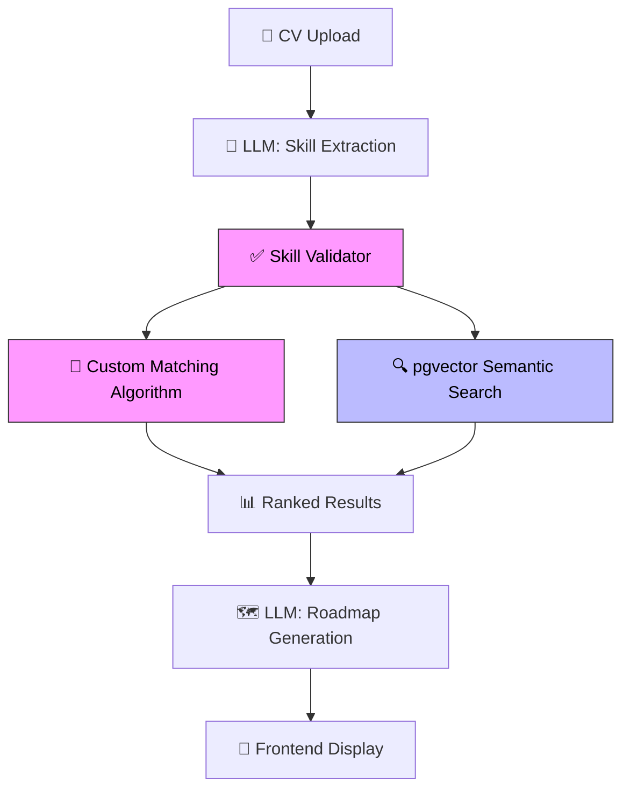

# 🎯 Career Path Advisor

<!--
📚 README KAYNAKLARI:
─────────────────────
1. GitHub README best practices:
   https://docs.github.com/en/repositories/managing-your-repositorys-settings-and-features/customizing-your-repository/about-readmes

2. Shields.io badges:
   https://shields.io/
   → Profesyonel badge'ler (build status, coverage, tech stack)

3. Mermaid diyagramları:
   https://mermaid.js.org/
   → GitHub'da direkt render edilen akış diyagramları

4. Awesome README örnekleri:
   https://github.com/matiassingers/awesome-readme
   → İlham almak için güzel README'ler

5. GitHub Profile README:
   https://www.youtube.com/results?search_query=github+readme+portfolio
   → Kendi GitHub profilinizi de güzelleştirin
-->


**AI-powered career advisory platform** that analyzes your CV, identifies skill gaps, and recommends personalized internships, courses, and certifications using semantic search.

> 🎓 Built for students and recent graduates seeking their first career opportunities.

---

## ✨ Features

| Feature | Description |
|---------|-------------|
| 📄 **CV Analysis** | Upload PDF/DOCX → AI extracts skills, experience, education |
| 🔍 **Semantic Search** | pgvector cosine similarity matches you with the best opportunities |
| 🧠 **Skill Gap Analysis** | Identifies what you need to learn for your target role |
| 🗺️ **Career Roadmap** | Generates 3-6-12 month learning plans |
| 🎯 **Smart Matching** | Custom hybrid algorithm (Jaccard + TF-IDF + weighted scoring) |
| ✅ **LLM Validation** | Fuzzy matching + known skill DB to verify AI outputs |
| ⚡ **Response Caching** | In-memory cache reduces API costs by ~60-70% |

---

## 🏗️ Architecture



**Pink = My custom algorithms** | **Blue = pgvector** | **White = LLM calls**

> 💡 LLM is used only where necessary (NLP + text generation). Matching and validation use my own algorithms for speed, cost, and explainability.

---

## 🛠️ Tech Stack

| Layer | Technology | Purpose |
|-------|-----------|---------|
| **Frontend** | Next.js 14, React, Tailwind CSS | Responsive UI |
| **Backend** | Python, FastAPI | REST API |
| **AI Pipeline** | LangGraph, LangChain | Multi-agent orchestration |
| **LLM** | OpenAI GPT-4o-mini | CV parsing, roadmap generation |
| **Embeddings** | OpenAI text-embedding-3-small | Semantic vectors (1536-dim) |
| **Database** | Supabase (PostgreSQL + pgvector) | Vector similarity search |
| **Matching** | Custom (Jaccard + TF-IDF + Weighted) | Explainable scoring |
| **Deploy** | Vercel (frontend) + Render (backend) | Production hosting |

---

## 📁 Project Structure

```
backend/
├── main.py                      # FastAPI entry point
├── graph/
│   ├── graph.py                 # LangGraph pipeline definition
│   ├── state.py                 # CareerState schema
│   ├── chains/                  # LLM chains
│   │   ├── cv_parser.py         # CV → structured data
│   │   ├── skill_analyzer.py    # Skill gap analysis
│   │   ├── opportunity_researcher.py  # Semantic search + fallback
│   │   └── roadmap_gen.py       # Career roadmap generation
│   ├── nodes/                   # LangGraph nodes
│   └── utils/
│       ├── skill_matcher.py     # 🟣 Custom matching algorithm
│       ├── llm_validator.py     # 🟣 LLM output validation
│       ├── cache_service.py     # 🟣 Response caching
│       ├── embedding_service.py # OpenAI embeddings
│       └── supabase_client.py   # DB + semantic search
├── scraping/                    # Data collection
└── tests/                       # pytest test suite
```

---

## 🚀 Quick Start

```bash
# 1. Clone
git clone https://github.com/YOUR_USERNAME/career-path-advisor.git
cd career-path-advisor/backend

# 2. Install dependencies
pip install -r requirements.txt

# 3. Set environment variables
cp .env.example .env
# Edit .env with your API keys

# 4. Run
uvicorn main:app --reload

# 5. Run tests
pytest tests/ -v
```

---

## 🧪 Testing

```bash
pytest tests/ -v                  # All tests
pytest tests/ -v -k "skill"       # Skill matcher tests only
pytest tests/ --cov=graph         # With coverage report
```

---

## 🤖 How It Differs From a Simple LLM Wrapper

| Aspect | Simple Wrapper | This Project |
|--------|---------------|-------------|
| Matching | LLM decides everything | Custom algorithm + LLM |
| Validation | Trust LLM blindly | Fuzzy match + skill DB verification |
| Cost | Every call = API cost | 60-70% reduced via caching |
| Speed | 3-5s per query | <500ms for cached queries |
| Explainability | "AI said so" | Detailed score breakdown |
| Testing | None | 20+ automated tests |
| Data | No persistence | Supabase + pgvector |

---

## 📄 License

MIT
